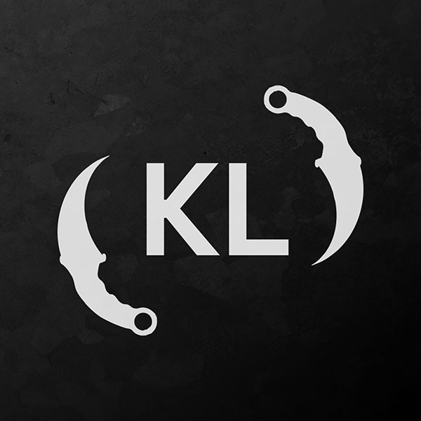

<a name="readme-top"></a>
<!-- PROJECT LOGO -->
<br />
<div align="center">
  <a href="https://github.com/YassineSMARA/knives-legacy-front" target="_blank" >
    
  </a>

<h3 align="center">Knives Legacy Front-end</h3>

  <p align="center">
    The source code of the front-end app of Knives Legacy
    <br />
    <br />
    <a href="https://www.knives-legacy.io/" target="_blank">View Live Version</a>
    ·
    <a href="https://marketplace.kalao.io/collection/0x114712e2813451f6eb64fee2be26338d83da56c0" target="_blank">Knives Collection</a>
  </p>
</div>

<!-- TABLE OF CONTENTS -->
<details>
  <summary>Table of Contents</summary>
  <ol>
    <li>
      <a href="#about-the-project">About The Project</a>
      <ul>
        <li><a href="#built-with">Built With</a></li>
      </ul>
      <ul>
        <li><a href="#knives">Knives</a></li>
      </ul>
      <ul>
        <li><a href="#supply">$SUPPLY</a></li>
      </ul>
      <ul>
        <li><a href="#raffle-system">Raffle System</a></li>
      </ul>
    </li>
    <li><a href="#how-it-was-created">How it was created</a></li>
    <li>
      <a href="#getting-started">Getting Started</a>
      <ul>
        <li><a href="#prerequisites">Prerequisites</a></li>
        <li><a href="#installation">Installation</a></li>
      </ul>
    </li>
    <li><a href="#contact">Contact</a></li>
  </ol>
</details>


<!-- ABOUT THE PROJECT -->
## About The Project

This repository contains the source code of the DAPP used by Knives Legacy.<br>
The framework used for the development is VueJS version 2.0 under typescript<br>
<p align="right">(<a href="#readme-top">back to top</a>)</p>

### Built With

<p align="left">
  <a href="https://vuejs.org/" target="_blank">
     
  </a>
  <a href="https://www.npmjs.com/" target="_blank">
     
  </a>
  <a href="https://www.typescriptlang.org/" target="_blank">
     
  </a>
</p>
<p align="right">(<a href="#readme-top">back to top</a>)</p>

<!-- Knives -->
## Knives
<div align="center">
  
</div>
<br>
Knives Legacy is a collection of ERC721 tokens available on the Avalanche blockchain.<br>

#### Tokenomics
The collection <strong>sold out</strong> at <strong>4444 NFT</strong>, they were released for <strong>free</strong>.
<br>

#### Description

Once staked, your knives will start producing $SUPPLY, a utility token (ERC20) which is non-tradable, non-transferable and only usable in our system.

Each knife produces its own tokens independently of the others, so you have to think about claiming the generated tokens to turn them into ERC20 tokens usable in our eco-system.

<a href="https://marketplace.kalao.io/collection/0x114712e2813451f6eb64fee2be26338d83da56c0" target="_blank"> 
  🛒 Check the collection on Kalao
</a>

<p align="right">(<a href="#readme-top">back to top</a>)</p>

<!-- $SUPPLY -->
## $SUPPLY
<div align="center">
  
</div>
<br>
$SUPPLY is the Knives staking rewards token. It's an ERC20 token.<br> 

#### Tokenomics
$SUPPLY has no max supply.

There is **no liquidity pool** behind the token, as it is not connected to the economy, and **only usable intrinsically** for the raffle system.

It's what we can call a **utility token**.

#### Description
The $SUPPLY token can only be utilized to buy raffle tickets.

<a href="https://snowtrace.io/address/0x1D61841a46fF7Ed90C9De6d956108582DE3688F6" target="_blank"> 
  🔍 Check the token on Snowtrace
</a>

<p align="right">(<a href="#readme-top">back to top</a>)</p>

<!-- Raffle System -->
## Raffle System

The raffle system is a way to give back to the community, and to reward the holders of Knives Legacy.<br>

These are fully on-chain raffles, which means that the winners are chosen randomly thanks to chainlink VRF.<br>

Stake your knives, produce your $SUPPLY, and choose the raffles you like to participate in!<br>

The raffle tickets can be bought with $SUPPLY, or with others specific tokens.<br>

<a href="https://www.knives-legacy.io/dashboard/knives/raffle" target="_blank"> 
  🎟️ Check the raffles
</a>

<p align="right">(<a href="#readme-top">back to top</a>)</p>

<!-- How it was created -->
## How it was created

I was commissioned by the Knives Legacy team to develop the front-end of their DAPP, With a very tight deadline ( one week ).

I chose to use VueJS version 2.0 under typescript for development and tried to use the Store in the most typed way possible.<br>

Indeed, it was something that I missed a lot during my previous development with VueJS.<br>

The Store was very unorganized, and it was difficult to know what was being used and why.<br>

So I decided to organize the logic in the following way:
- **One folder** per **module**
- The state types in a **sepate file** (types.ts)
- The state in a **separate file** (state.ts)
- The mutations in a **separate file** (mutations.ts)
- The actions in a **separate file** (actions.ts)

I found that this organization allowed me to do better and to use less code in the components.
Moreover, it will allow me to **reuse** the modules in other projects.

### Design

As for the design, I had to work with an **existing design** that was **already implemented** under react on another website.

So I had to **inspect this website**, **improve** the design and make it **responsive** as it wasn't usable on mobile.

I am not very comfortable with css, but I find that I am improving from project to project.

<p align="right">(<a href="#readme-top">back to top</a>)</p>

<!-- GETTING STARTED -->
## Getting Started

To get a local copy up and running follow these simple example steps.

### Prerequisites

* npm
  ```sh
  npm install npm@latest -g
  ```

### Installation

1. Clone the repo
   ```sh
   git clone https://github.com/YassineSMARA/knives-legacy-front.git
   ```
2. Install NPM packages
   ```sh
   npm install
   ```
3. Launch the app
   ```env
   npm run serve
   ```
3. Navigate to http://localhost:8080/


<p align="right">(<a href="#readme-top">back to top</a>)</p>

<!-- CONTACT -->
## Contact

Yassine SMARA <br>
Discord: Krabs#9454 <br>
Mail: 1yassine.smara@gmail.com

<p align="right">(<a href="#readme-top">back to top</a>)</p>
